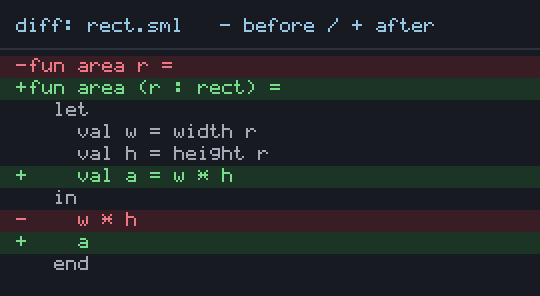

# sml-diff

[](https://github.com/sjqtentacles/sml-diff/actions/workflows/ci.yml)

Sequence diffing for Standard ML, via the Myers O(ND) algorithm.



*Generated by [`examples/diff_demo.sml`](examples/diff_demo.sml) (`make
example`): `Diff.diffLines` between two versions of a source file, rendered as
a colored unified diff (green insert / red delete / gray context) with a small
bitmap font. Encoded to PNG via the vendored `sml-image`.*

`sml-diff` computes the shortest edit script between two sequences using
Eugene Myers' classic O(ND) difference algorithm. The core works on any
`'a vector` with a caller-supplied equality predicate, and there are
convenience helpers for diffing text line by line.

An edit script is a list of:

```sml
datatype 'a edit = Keep of 'a | Insert of 'a | Delete of 'a
```

- `Keep x`   -- `x` is common to both sequences
- `Delete x` -- `x` is in the first sequence only
- `Insert x` -- `x` is in the second sequence only

Reading the `Keep`s gives the longest common subsequence; the `Keep`/`Delete`
elements reconstruct the first sequence and `Keep`/`Insert` the second.

## Portability

Pure Standard ML using only the Basis library. Verified on:

- **MLton**
- **Poly/ML**

The sources are shared via an [ML Basis](http://mlton.org/MLBasis) (`.mlb`)
file. MLton consumes it natively; for Poly/ML the test target simply `use`s
the sources in order.

## Building and testing

```sh
make test        # build + run the suite under MLton (default)
make test-poly   # run the suite under Poly/ML
make all-tests   # run under both
make clean
```

## Installing with smlpkg

`sml-diff` follows the conventions of the
[`smlpkg`](https://github.com/diku-dk/smlpkg) package manager. There is no
registry or account to sign up for -- packages are referenced directly by
their git URL. In your own project's directory:

```sh
smlpkg add github.com/sjqtentacles/sml-diff
smlpkg sync
```

This downloads the library into `lib/github.com/sjqtentacles/sml-diff/`.
Reference it from your own `.mlb` with a relative path to `diff.mlb`:

```
lib/github.com/sjqtentacles/sml-diff/diff.mlb
```

For Poly/ML, `use` the sources in order:

```sml
use "lib/github.com/sjqtentacles/sml-diff/diff.sig";
use "lib/github.com/sjqtentacles/sml-diff/diff.sml";
```

## Usage

Diff two texts and print a unified-style result:

```sml
val script = Diff.diffLines "line1\nline2\nline3\n"
                            "line1\nlineX\nline3\n"
val () = print (Diff.formatUnified script ^ "\n")
(*  line1
   -line2
   +lineX
    line3        *)
```

Diff arbitrary sequences with your own equality:

```sml
(* characters *)
val es = Diff.diff (op = : char * char -> bool)
                   (Vector.fromList (explode "ABCABBA"))
                   (Vector.fromList (explode "CBABAC"))

val dist = Diff.editDistance (op =) a b   (* number of inserts + deletes *)
val common = Diff.lcs (op =) a b          (* longest common subsequence  *)

(* lists, case-insensitive, etc. *)
val es2 = Diff.diffList (fn (x, y) => Char.toLower x = Char.toLower y)
                        (explode "Hello") (explode "hello")
```

## Project layout

```
sml.pkg                                         smlpkg manifest
Makefile                                        build + test
lib/github.com/sjqtentacles/sml-diff/
  diff.sig                                      the DIFF signature
  diff.sml                                      the Myers implementation
  diff.mlb                                      MLB for consumers
test/
  test.mlb                                      test basis (MLton)
  test.sml                                      assertion suite
.github/workflows/ci.yml                        CI (MLton + Poly/ML)
```

## License

MIT. See [LICENSE](LICENSE).
